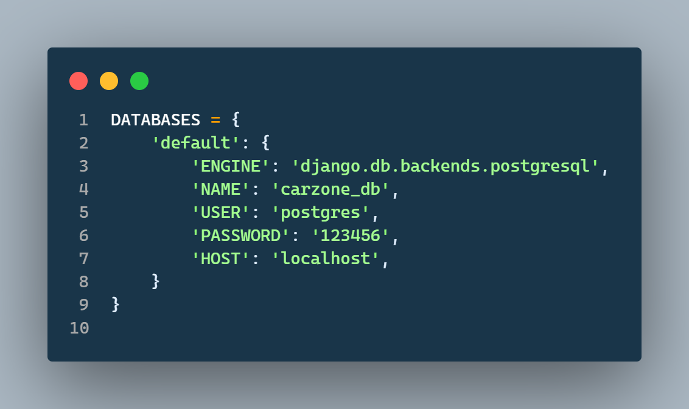
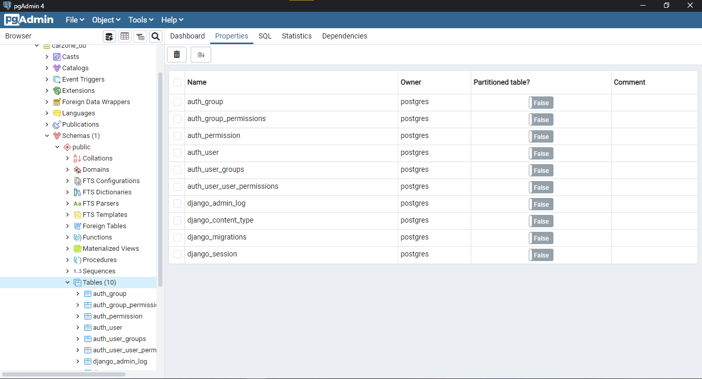

# Car Zone
This peoject is purely based on django which is python web framework.

## Setup steps
- Clone the code
- Write command `pip install pipenv` to create virtual env and install packages form pipfile
- After installing `pipenv` wte command `pipenv install` This command will create virtual env and install all packages automatically.
- Write command `pipenv shell` to start the virtual env
- Write command `python manage.py migrate` to migrate the database
- Write command `python manage.py createsuperuser` to create superuser
- Write command `python manage.py runserver` to start the server

## 
OR

- Install all tha backages using command `pip install -r requirements.txt`
- Now you need to install **POSTGRESQL** for databse and create your data base and give your password

- After setup like above snapshot you need to run command `python manage.py migrate`

