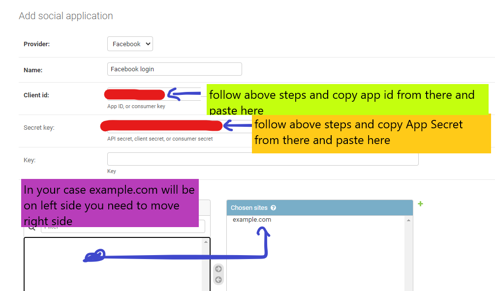

# Car Zone

This peoject is purely based on django which is python web framework.

## Setup steps

- Clone the code
- Write command `pip install pipenv` to create virtual env and install packages form pipfile
- After installing `pipenv` wte command `pipenv install` This command will create virtual env and install all packages automatically.
- Write command `pipenv shell` to start the virtual env
- Write command `python manage.py migrate` to migrate the database
- Write command `python manage.py createsuperuser` to create superuser
- Write command `python manage.py collactstatic` to run the server
- Write command `python manage.py runserver` to start the server

---

## OR

---

- Install all tha backages using command `pip install -r requirements.txt`
- Now you need to install **POSTGRESQL** for databse and create your data base and give your password

- After setup like above snapshot you need to run command `python manage.py migrate`

## Login wirh facebook setup

- Go to <https://developers.facebook.com/>
- Clock on get started
- Create a new app
- Go to products and select facebook login set up
- Click on web
- Enter the url of the server like this `http://localhost:8000/` because facebook will not recignize `127.0.0.1` as a valid url
- Click on save
- Got to `Settings` and `Basic` tab copy the `App ID` and `App Secret`
- Go to `http://localhost:8000/admin/` and login with superuser credentials
- In admin panel go to `Social Account` and add a new `Social application`
- In place of `Provider` select `Facebook` and `Name` write `Facebook login`
- In `Client id` write the `App ID` that we copied from facebook
- In `Secret` write the `Secret key` that we copied from facebook
- from sits in available tab you will see example.com just shift it to right side and save it
- After saving you will see go to admin home and you will se site option go there and click in `example.com` there change Domain to `localhost:8000` and Display name to `localhost:8000` and save it

## Login with google setup

- Go to admin panel and add a `social application`
  - In place of `Provider` select `Google`
  - In `Client id` write the `Client ID` that we copied from google
  - In `Secret` write the `Secret key` that we copied from google
- Go to <https://console.developers.google.com/> and login with google account
- Create a new project
  - In `Project name` write `Carzone Login` and click on create
- Go to `OAuth consent screen` and select `External` and click on `Create`
  - In Accplication name write `Carzone Project`
  - And scroll down and clock on save and contiune
- Go to `Credentials` and select `Create credentials`
- select `OAuth consent screen`
  - Application type is `Web application`
  - Name is `Carzone`
  - Authorized JavaScript origins is `http://localhost:8000` and click add url and write `http://127.0.0.1:8000`
  - Authorized redirect URIs is `http://localhost/socialaccounts/google/login/callback` and click add uris and write `http://127.0.0.1:8000/socialaccounts/google/login/callback`
  - finally click on `Create`
  - After you will get yout `Client ID` and `Client secret`
- Copy and paste `Client ID` and `Client secret` to admin panel
- Move localhost:8000 to right side and save it
